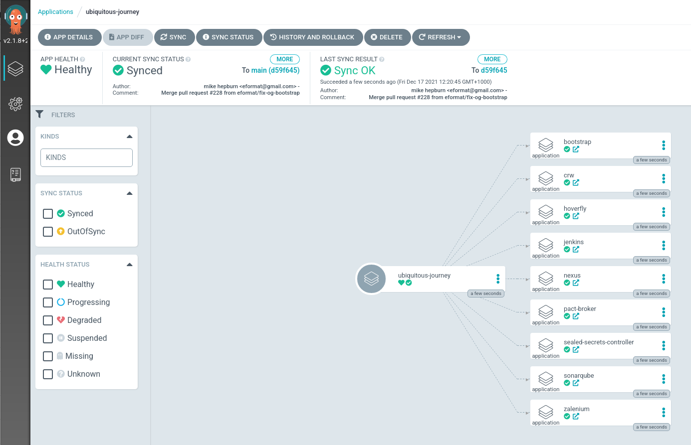

# 🦄 ubiquitous-journey 🔥

🧰 This repo is an Argo App definition which references [other helm charts](https://github.com/redhat-cop/helm-charts.git). It should not exclusively run Helm Templates but be a more generic Argo App which could reference Kustomize or Operators etc.

🎨 This is the new home for the evolution of what was [Labs CI / CD](https://github.com/rht-labs/labs-ci-cd.git). This project represents a major milestone in moving away from the 3.x OpenShift clusters to a new GitOps approach to tooling, app management and configuration drift using [ArgoCD](https://argoproj.github.io/argo-cd/).

There are two components (one in each folder) to this repository. Each part can be used independently of each other but sequentially they create the full stack. If you already have an ArgoCD instance you want to add the tooling to just [move to part 2](docs/bootstrap-argocd.md#tooling-for-application-development-🦅):
1. Ubiquitous Journey - Contains all the tools, collaboration software and day2ops to be deployed on Red Hat OpenShift. This includes chat applications, task management apps and tools to support CI/CD workflows and testing. For the complete list and details: [What's in the box?👨](docs/whats-in-the-box.md)
2. An example (`pet-battle`) to show how the same structure can be used to implement GitOps for a simple three tiered app stack.

## How do I run it? 🏃‍♀️

### Prereq 
0. OpenShift 4.6 or greater (cluster admin user required) - https://try.openshift.com
1. Install helm v3 (cli) or greater - https://helm.sh/docs/intro/quickstart

Install an instance of ArgoCD. There are several methods to install ArgoCD in OpenShift. Pick your favourite flavour 🍦

1. Use the Red Hat supported GitOps Operator (configured by default as cluster wide and to deploy the operator and an instance in `labs-ci-cd`)
```bash
helm repo add redhat-cop https://redhat-cop.github.io/helm-charts
helm upgrade --install argocd \
  --create-namespace \
  --namespace labs-ci-cd \
  redhat-cop/gitops-operator
```

If using helm, it's **strongly** recommend you get a copy of the `values.yaml` and make edits that way. This values file can be checked in to this repo and be kept if further changes are needed such as adding in private `repositoryCredentials` or other handy stuff such as `secrets` and `namespaces` etc. For example, you have `argocd-values.yaml` file with your changes:
```bash
helm upgrade --install argocd \
  --create-namespace \
  --namespace labs-ci-cd \
  -f argocd-values.yaml \
  redhat-cop/gitops-operator
```

**NOTE**
```bash
Error: rendered manifests contain a resource that already exists. Unable to continue with install: Subscription "openshift-gitops-operator" in namespace "openshift-operators" exists and cannot be imported into the current release: invalid ownership metadata;.....
```
If you get an error such as this when installing argocd; it is because the `openshift-gitops-operator` has already been installed. This means the APIs provided by it (such as `ArgoCD`, `Application`, `ArgoProject` etc) are already available for us to consume. We just need to update the Cluster instance of ArgoCD to allow it deploy a new ClusterScoped instance to our namespace.
```bash
./patch-gitops-operator.sh labs-ci-cd
```
Then simply run the install command by passing in the parameter `--set operator=null` to the chart to not install the operator but only create an instance in your provided namespace.


OR

1. Go to the Operator Hub on OpenShift and install via UI. But remember, you should store the configuration of the ArgoCD Custom Resource instance definition for repeatability. You'll also need to edit the subscription to disable the default argocd instance and allow ClusterScoped ones be created in any project.
```yaml
# oc edit subscription/openshift-gitops-operator -n openshift-operators
spec:
  config:
    env:
    - name: DISABLE_DEFAULT_ARGOCD_INSTANCE
      value: "true"
    - name: ARGOCD_CLUSTER_CONFIG_NAMESPACES
      value: labs-ci-cd # YOUR LIST OF NAMESPACES THAT YOU WANT CLUSTER SCOPED ARGOCD IN
  channel: stable
  installPlanApproval: Automatic
  name: openshift-gitops-operator
  source: redhat-operators
  sourceNamespace: openshift-marketplace
  startingCSV: openshift-gitops-operator.v1.3.1
```

#### 🤠 Deploying the Ubiquitous Journey
A handy one liner to deploy all the default software artifacts in this project using their default values. Just make sure the namespace you set below is the same one as where your ArgoCD from the prereqs is running :)
```bash
helm upgrade --install uj --namespace labs-ci-cd .
```


If you Open your instance of ArgoCD in the UI (`echo https://$(oc get route argocd-server --template='{{ .spec.host }}' -n labs-ci-cd)`) - you should see lots of things spinning up



To deploy the whole thing AND the kitchen sink... you can set `enabled: true` on all of the definitions in the `values.yaml` file 🧨 .... 💥


If you want to make changes to the repo and do proper GITOPS then fork and make your changes in the fork. Just update the `source` in values.yaml to make sure ArgoCD is pulling from the correct source. If  you've already forked the repo and want to deploy quickly you can also run:
```
helm upgrade --install uj \
  --set source=https://github.com/<YOUR_FORK>/ubiquitous-journey.git \
  --namespace labs-ci-cd .
```

### Cleanup 
Uninstall and delete all resources in the various projects
```bash
# remove the ubiquitous-journey project from ArgoCD
# This may take a minute or two so it's best to keep an eye on the resources in ArgoCD before removing it  
helm uninstall uj --namespace labs-ci-cd

# remove your ArgoCD instance
helm uninstall argocd

# to cleanup all the namespaces created
TEAM_NAME=labs; oc delete projects ${TEAM_NAME}-ci-cd ${TEAM_NAME}-dev ${TEAM_NAME}-test ${TEAM_NAME}-stage ${TEAM_NAME}-clusterops ${TEAM_NAME}-pm
```

### Debug
To debug one of the ubiquitous-journey values files, just to see values are passing as expected etc and get a view of what argocd is going to roll out. Run 
```
# example debugging the ArgoCD `Application` manifests from the example deployment 
helm install debug --dry-run -f pet-battle/test/values.yaml . 
```

## How can I bring my own tooling?

TODO - add some instructions for adding:
1) new helm charts
2) new Operators etc

## Contributing

## Help

You can find low hanging fruit to help [here](docs/help.md).
