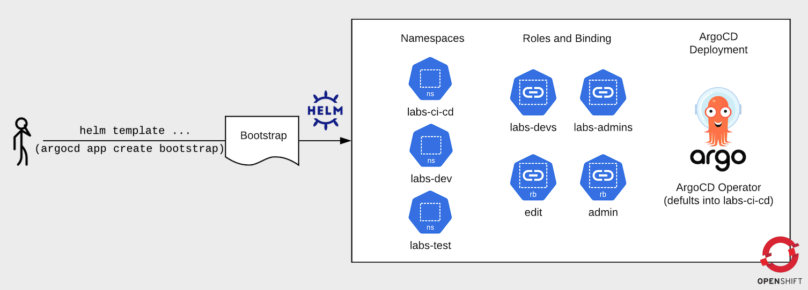
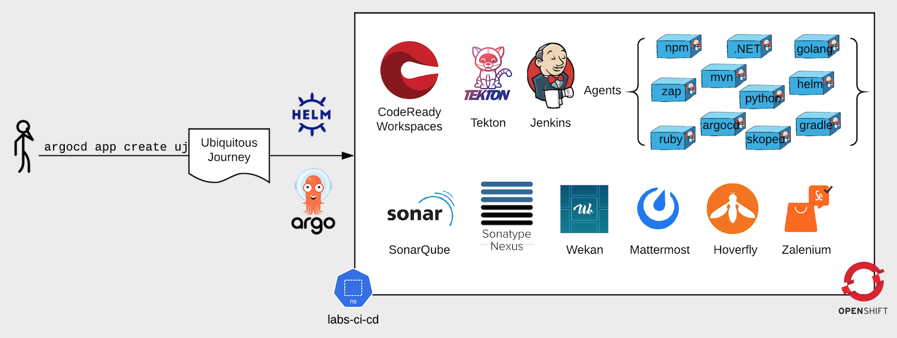

## Bootstrap projects and ArgoCD 🍻



The `bootstrap` helm chart will create your **Labs's CI/CD**, **Dev**, **Test** and **Staging** namespaces. Fill them with service accounts and normal role bindings as defined in the [bootstrap project helm chart](https://github.com/redhat-cop/helm-charts/blob/master/charts/bootstrap-project/values.yaml). You can override them by updating any of the values in `bootstrap/values-bootstrap.yaml` before running `helm template`.
It will also deploy an ArgoCD Instance into one of these namespaces (default to `labs-ci-cd`) along with an instance of Sealed Secrets by Bitnami if enabled (default disabled).

If you want to override namespaces see [Deploy to a custom namespace](deploy-custom-namespace.md).

1. Bring down the chart dependencies and install `bootstrap` helm chart in a sweet oneliner 🍾:
```bash
helm template bootstrap --dependency-update  -f bootstrap/values-bootstrap.yaml bootstrap | oc apply -f -
```

2. Because this is GitOps we should manage the config of these roles, projects and ArgoCD itself by adding it to our newly created ArgoCD instance. This means all future changes to these can be tracked and managed in Git! Login to Argo and run the following command.

To login with argocd from CLI using sso:
```bash
argocd login $(oc get route argocd-server --template='{{ .spec.host }}' -n labs-ci-cd):443 --sso --insecure
```
else if no sso:
```bash
argocd login --grpc-web $(oc get routes argocd-server -o jsonpath='{.spec.host}' -n labs-ci-cd) --insecure
```

Finally create the Argo app `bootstrap-journey`:
```bash
argocd app create bootstrap-journey \
    --dest-namespace labs-ci-cd \
    --dest-server https://kubernetes.default.svc \
    --repo https://github.com/rht-labs/ubiquitous-journey.git \
    --path "bootstrap" --values "values-bootstrap.yaml"
```

By default the ArgoCD service account use Cluster wide RoleBindings. Namespace control can be restricted in the bootstrap values. This will prevent certain actions by ArgoCD (e.g. operator CRD deployments) and not all of the listed applications may work (e.g. Tekton, CRW):
```
  # argocd rbac only in listed namespaces
  namespaceRoleBinding:
    enabled: true
    namespaces:
    - name: *ci_cd
    - name: *dev
    - name: *test
    - name: *stage
```

### Tooling for Application Development 🦅


Our standard approach is to deploy related toolings into same namespaces. There are two ways you can deploy this project - as an Argo App of Apps or a helm3 template.

##### (A) Deploy using argo app of apps ...
See: [ArgoCD App of Apps approach](https://argoproj.github.io/argo-cd/operator-manual/declarative-setup/#app-of-apps)
* Deploy the base tooling for building out CI/CD pipelines to the `labs-ci-cd` namespace.
```bash
argocd app create ubiquitous-journey \
    --dest-namespace labs-ci-cd \
    --dest-server https://kubernetes.default.svc \
    --repo https://github.com/rht-labs/ubiquitous-journey.git \
    --path "ubiquitous-journey" --values "values-tooling.yaml"
argocd app sync ubiquitous-journey
```

* There is a separate set of tools which can also be added to your stack. These include some project management and supplimental things such as `Wekan` or `Mattermost`. By default they will be deployed to the `lab-pm` namespace. To create these run the following commmand:
```bash
argocd app create uj-extras \
    --dest-namespace labs-ci-cd \
    --dest-server https://kubernetes.default.svc \
    --repo https://github.com/rht-labs/ubiquitous-journey.git \
    --path "ubiquitous-journey" --values "values-extratooling.yaml"
argocd app sync uj-extras
```

* Deploy `day2ops` tasks to monitor and audit the cluster to the `labs-cluster-ops` namespace.
```bash
argocd app create uj-day2ops \
    --dest-namespace labs-ci-cd \
    --dest-server https://kubernetes.default.svc \
    --repo https://github.com/MY_FORK/ubiquitous-journey.git \
    --path "ubiquitous-journey" --values "values-day2ops.yaml"
argocd app sync uj-day2ops
```


##### (B) Deploy using helm ...
```bash
helm template labs -f argo-app-of-apps.yaml ubiquitous-journey/ | oc apply -f -
```

_If you wanted to create custom namespaces like `my-ci-cd` for all the tooling to be deployed to, the steps are simple. Fork this repo and follow [deploy to a custom namespace](deploy-custom-namespace.md)_

## Example Application Deploy 🌮


Deploy the example app `pet-battle` using GitOps! This example project serves as a reference of how you could deploy an application as an App of Apps. The app is pre-built and hosted on quay. After you deploy the application for the first time update the `app_tag` to `purple` in `example-deployment/values-applications.yaml` and commit the changes to see GitOps in action!

Create using helm:
```bash
helm template catz -f example-deployment/values-applications.yaml example-deployment/ | oc apply -n labs-ci-cd -f -
```
or using argocd:
```bash
argocd app create catz \
    --dest-namespace labs-ci-cd \
    --dest-server https://kubernetes.default.svc \
    --repo https://github.com/rht-labs/ubiquitous-journey.git \
    --path "example-deployment" --values "values-applications.yaml"
argocd app sync catz
```


## Cleaning up ArgoCD Apps 🧹
Sometimes ArgoCD `Application` CRs can get stuck after they've been deleted and cause funky issues.
This is particularly annoying while testing with multiple ArgoCD instances.
To *force delete* the application CRs run the `force-delete-application-cr.sh` script pointing to the namespace your `Application` CRs are stored. This will remove the `Finalizers`.
```bash
oc login ...
./force-delete-application-cr.sh labs-ci-cd
```

## Metrics 📉

By setting `argocd.metrics.enabled: true` in `values-bootstrap.yaml`, promethus and grafana are deployed by the operator to capture argocd metrics.

An example of the latest grafana dashboard for argocd is available here
- https://raw.githubusercontent.com/argoproj/argo-cd/master/examples/dashboard.json

